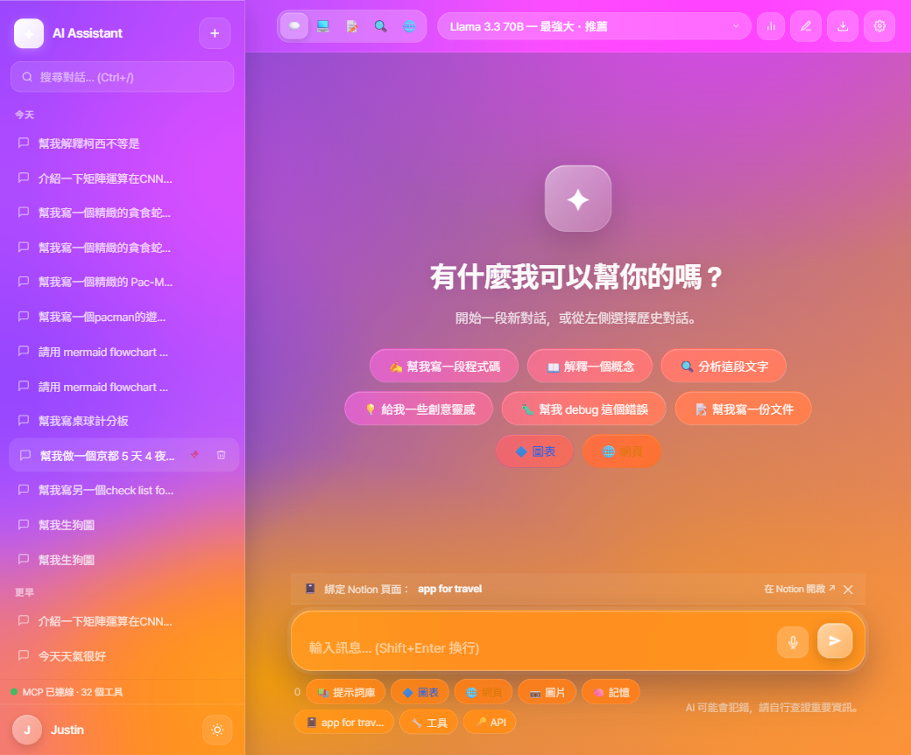
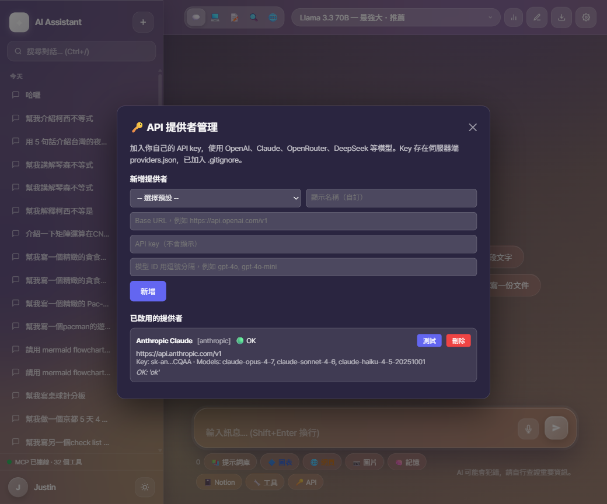
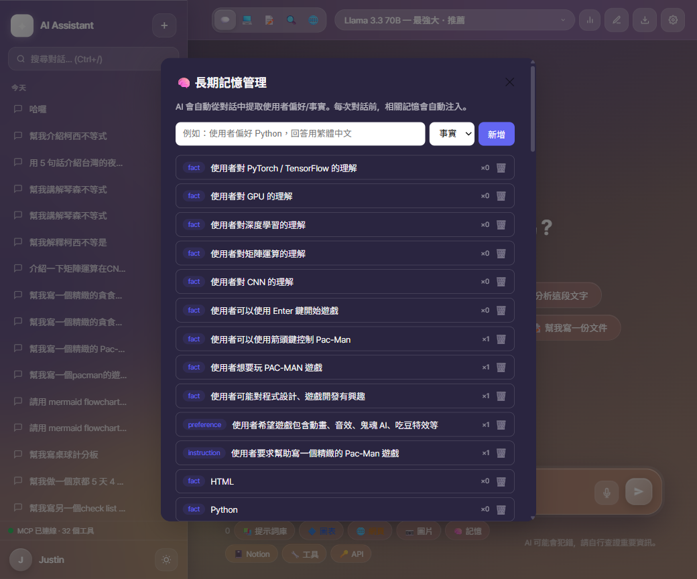
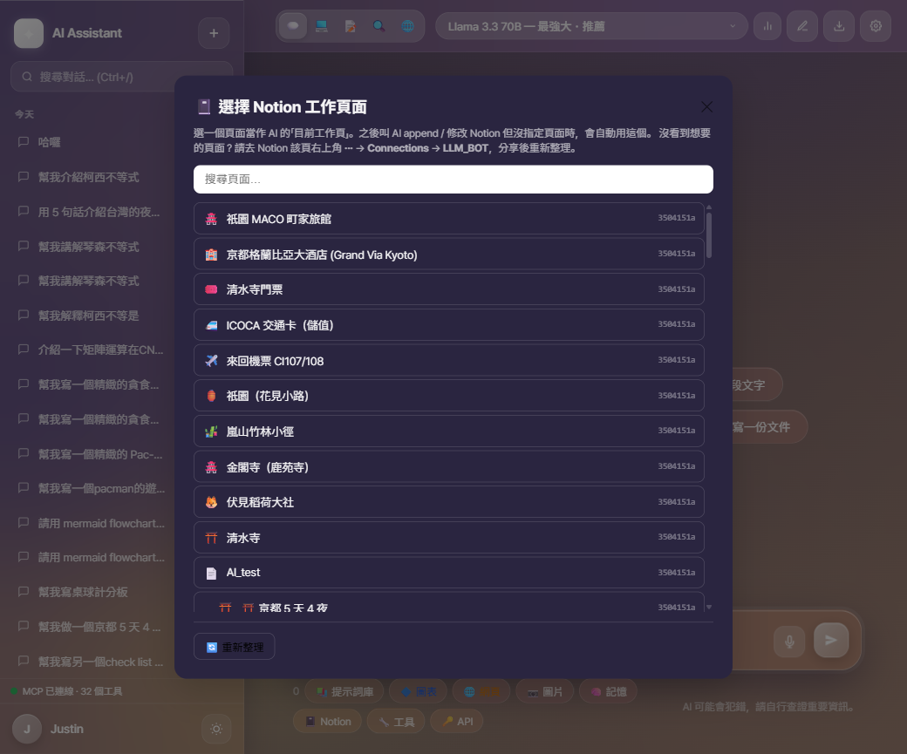
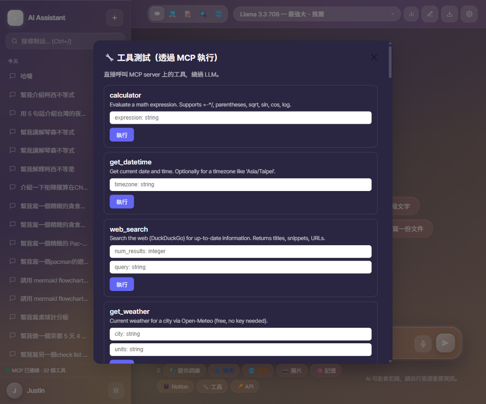
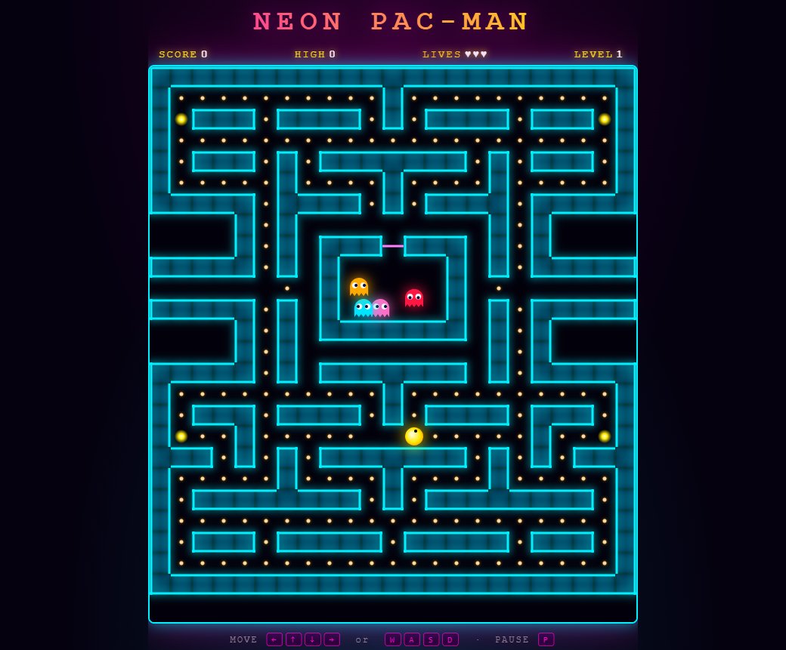

<div align="center">

# ✦ GenAI LLM Chatbot v2

**An agentic AI chatbot platform — MCP tools · multimodal vision · code execution · long-term memory · analytics dashboard.**


</div>

---

## 📸 Screenshots

<div align="center">

|  |  |
|---|---|
| **Welcome — Vision Pro glass UI** | **🔑 Multi-provider API manager** |
|  |  |
| **🧠 Long-term memory manager** | **📓 Notion page picker** |
|  |  |
| **🔧 23 MCP tools — interactive test panel** | **🎮 Inline artifact preview (Pac-Man)** |
|  |  |

</div>

---

## 🚀 Headline Features

| Capability | What it does |
|------------|-------------|
| 🧠 **Long-term Memory** | SQLite-backed user facts — auto-extracted from dialogue, auto-injected before each turn. |
| 👁️ **Multimodal Vision** | Drag-drop image upload, auto-routed to Llama 4 Scout vision model. |
| ⚡ **Auto Routing** | Picks the best Groq model per message (fast / long-ctx / vision / general). |
| 🔧 **23 MCP Tools** | Calculator · datetime · web search · weather · image gen · filesystem · GitHub · arXiv · Wikipedia · YouTube · stocks · crypto · Python execution · 5 Notion tools. |
| 🔌 **Real MCP Server** | Standalone subprocess using the official `mcp` Python package (JSON-RPC over stdio). |
| 🔑 **Custom API Providers** | Plug in OpenAI · Claude · OpenRouter · DeepSeek · Together · Mistral · Ollama · LM Studio. |
| 🎨 **Image Generation** | Pollinations.ai integration (free, no key) — 8 styles. |
| 💻 **Code Interpreter** | Sandboxed Python execution. Auto-captures matplotlib plots. |
| 📊 **Analytics Dashboard** | 9 charts: token trend · model dist · 365-day heatmap · TF-IDF topic clusters · cosine similarity · word cloud · tool ranking · latency · activity. |
| 📝 **Notion Integration** | Search, create, append pages from chat (requires Notion Integration Token). |
| 🌐 **Live Citations** | Web search results auto-cite sources inline. |
| 🎬 **Inline Artifacts** | HTML / SVG / Mermaid / canvas — click "▶ 預覽" to render in side panel. |

---

## 🚀 Quick Start

### 1. Clone & install

```bash
git clone https://github.com/justin999-tech/GenAI_LLM1.git
cd GenAI_LLM1
python -m venv venv
venv\Scripts\activate          # Windows
# source venv/bin/activate     # macOS / Linux
pip install -r requirements.txt
```

### 2. Set your Groq key

```bash
echo "GROQ_API_KEY=gsk_your_key_here" > .env
```

> Get a **free** key at [console.groq.com](https://console.groq.com/) — no credit card required.

### 3. (Optional) Add more providers

Click **🔑 API** in the bottom toolbar to add OpenAI / Claude / OpenRouter / DeepSeek / Together / Mistral / Ollama / LM Studio. Keys are stored in `providers.json` (gitignored).

### 4. (Optional) Notion integration

```bash
echo "NOTION_TOKEN=secret_your_token" >> .env
```

Get a token at [notion.so/my-integrations](https://www.notion.so/my-integrations) and share your pages with the integration.

### 5. Run

```bash
python app.py
```

Open <http://127.0.0.1:5000>.

---

## 🎬 Demo Workflow (5-min walkthrough)

Use this when showing the project to others — each step demonstrates a different subsystem:

1. **Welcome screen** → switch model from `Auto Routing` to `Llama 3.3 70B`.
2. **Ask anything** → "幫我畫一個正弦波" — triggers `execute_python` MCP tool, captures matplotlib plot inline.
3. **Drag-drop an image** → auto-routes to vision model, uses `image_url` content array.
4. **Tool combo** → "查 Apple 股價並換算成日圓" — uses `stock_price` + `web_search` (USD→JPY rate) chained.
5. **Long-term memory** → tell it "我喜歡用繁體中文回答" → next turn, it remembers (Ctrl+M to inspect).
6. **Notion sync** → click 📓 Notion picker, pick a page, then say "把剛剛的對話總結到這頁" — agent calls `notion_append_to_page`.
7. **Inline artifact** → "幫我做一個 Pac-Man" — model returns `<html>` block, click ▶ 預覽 to play in side panel.
8. **Dashboard** → click 📊 to see token trend, tool ranking, 365-day heatmap, topic clusters, cosine similarity matrix.

---

## 📊 Analytics Dashboard

The `/dashboard` page renders 9 real-time charts driven by your conversation history:

- **Token usage trend** — daily input/output (line chart)
- **Model distribution** — which model you used most (donut)
- **365-day activity heatmap** — GitHub-style calendar
- **Tool call ranking** — most-invoked MCP tools (bar chart)
- **Topic clusters** — TF-IDF auto-categorisation
- **Conversation similarity** — cosine similarity Top 5 (heatmap)
- **Word frequency cloud** — your most-used words
- **Tool latency** — average ms per tool
- **Live overview** — totals & 24h trend

Auto-refreshes every 60 seconds.

---

## 🤖 Available Models

Built-in (Groq, free tier):

| Model | Speed | Best For |
|-------|-------|----------|
| ⚡ **Auto Routing** | — | Picks the right model per message |
| 🥇 Llama 3.3 70B | ⚡⚡ | General use — most capable |
| 🚀 Llama 3.1 8B | ⚡⚡⚡⚡ | Quick answers |
| 👁️ Llama 4 Scout | ⚡⚡ | Image analysis (vision) |
| 📖 Mixtral 8x7B | ⚡⚡⚡ | Long documents |
| 🔵 Gemma 2 9B | ⚡⚡⚡ | Google's model |

Add your own via 🔑 API: OpenAI · Anthropic Claude · OpenRouter · DeepSeek · Together AI · Mistral · Ollama · LM Studio · any OpenAI-compatible endpoint.

---

## 🔧 23 MCP Tools

Every tool is exposed as a real MCP tool (JSON-RPC over stdio) and the chatbot can invoke them mid-conversation.

| Category | Tools |
|----------|-------|
| 🧮 Basic | `calculator` · `get_datetime` · `web_search` · `get_weather` |
| 🎨 Generation | `generate_image` (Pollinations.ai, 8 styles) |
| 📁 Filesystem | `read_file` · `write_file` · `list_directory` · `search_files` (sandboxed) |
| 🌐 Web | `fetch_url` · `github_search_repos` · `github_read_file` · `youtube_transcript` |
| 📚 Academic | `arxiv_search` · `wikipedia_search` |
| 💹 Finance | `stock_price` (Yahoo) · `crypto_price` (CoinGecko) |
| 💻 Code | `execute_python` (sandboxed, matplotlib auto-capture) |
| 📝 Notion | `notion_search` · `notion_list_pages` · `notion_create_page` · `notion_append_to_page` · `notion_query_database` |

You can also test any tool standalone via the **🔧 工具** button in the bottom toolbar.

---

## 🧬 Architecture

```
[Browser]
    │
    ▼
[Flask /chat/stream]
    ├─→ memory.MemoryManager      (SQLite, auto-injected per turn)
    ├─→ router.route              (vision/fast/long-ctx/default model)
    ├─→ providers.get_client      (Groq built-in OR user-added provider)
    └─→ tools.agentic_stream      (multi-round Groq function calling)
              │
              ▼
        mcp_client.call_tool      (sync ↔ async bridge)
              │  JSON-RPC over stdio
              ▼
        mcp_server.py             (subprocess)
              │
              └─→ mcp_tools/      (8 modules · 23 tools)
                    ├─ basic       (calc/datetime/search/weather)
                    ├─ image_gen   (Pollinations.ai)
                    ├─ filesystem  (sandboxed read/write)
                    ├─ web         (fetch/github/youtube)
                    ├─ academic    (arxiv/wikipedia)
                    ├─ finance     (stock/crypto)
                    ├─ code_exec   (sandboxed Python)
                    └─ notion_tools (5 Notion API tools)
```

---

## 🗂️ Project Structure

```
GenAI_LLM1/
├── app.py                  # Flask routes & API endpoints
├── chatbot.py              # Built-in Groq model list
├── memory.py               # Long-term memory (SQLite)
├── router.py               # Auto model routing
├── tools.py                # Tool defs + agentic loop
├── providers.py            # Multi-provider client manager
├── analytics.py            # Dashboard data computations
├── mcp_server.py           # MCP server (stdio)
├── mcp_client.py           # MCP client (sync/async bridge)
├── mcp_tools/              # 8 tool modules · 23 tools
├── templates/
│   ├── index.html          # Main chat UI
│   └── dashboard.html      # Analytics dashboard
├── static/
│   ├── style.css
│   └── uploads/            # User images + AI-generated images
└── docs/
    └── screenshots/        # README gallery
```

Excluded from git: `.env` · `providers.json` · `lab2.db` · `conversations*.json` · `static/uploads/*` · `*.log`

---

## ⌨️ Keyboard Shortcuts

| Shortcut | Action |
|----------|--------|
| `Ctrl + N` | New conversation |
| `Ctrl + M` | Open memory manager |
| `Ctrl + E` | Open notes workspace |
| `Ctrl + P` | Open prompt library |
| `Ctrl + ,` | Open settings |
| `Ctrl + /` | Search conversations |
| `Enter` | Send message |
| `Shift + Enter` | New line |

---

## 🛠️ Tech Stack

| Layer | Technology |
|-------|-----------|
| Backend | Python · Flask · SQLite |
| AI | Groq API (LPU inference) · OpenAI-compatible providers |
| MCP | Official `mcp` Python SDK · stdio transport |
| Frontend | Vanilla JS · Chart.js · marked.js · highlight.js · KaTeX · Mermaid.js |
| Image | Pollinations.ai (free, no key) |
| Web data | DuckDuckGo · GitHub Search · arXiv · Wikipedia · Open-Meteo · CoinGecko · Yahoo Finance |

---

## 🐛 Troubleshooting

| Symptom | Likely cause | Fix |
|---------|-------------|-----|
| Model dropdown shows just `v` chevron | JS error blocking init | Check browser DevTools → Console for red errors |
| Modal text invisible (white-on-white) | Missing CSS variables | Pull latest — fixed in commit defining `--bg-primary` |
| `GROQ_API_KEY not set` | `.env` missing | Create `.env` with `GROQ_API_KEY=gsk_...` |
| MCP tools return "fallback" | MCP server not started | Check `mcp_server.log` for errors |
| Notion tools fail | `NOTION_TOKEN` missing OR page not shared with integration | Share the target page from Notion's `...` → Connections menu |
| Image upload fails | File over 10 MB | Compress or use a smaller image |

---

<div align="center">

Made with ❤️ · MIT License · Lab 2 v2.0.0

</div>
