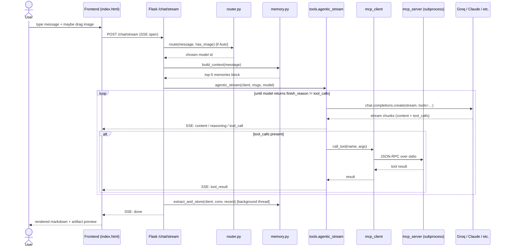

# System Architecture

> Architecture diagrams for **GenAI LLM Chatbot v2**. The 5 HW02 required
> features are highlighted in blue.

---

## High-level diagram (Mermaid)

```mermaid
graph TB
    User([👤 User])

    subgraph Frontend["🖥 Frontend  ·  Vanilla JS · Glassmorphism UI"]
        UI[index.html<br/>Chat · Drag-drop image · Artifact preview]
        Dash[dashboard.html<br/>9 real-time charts]
    end

    subgraph Backend["🐍 Flask Backend  ·  app.py"]
        Stream[/chat/stream<br/>Server-Sent Events streaming/]

        subgraph FiveFeatures["★ 5 HW02 Required Features"]
            F1[⚡ AUTO ROUTING<br/>router.py<br/>vision · fast · long · default]
            F2[👁 MULTIMODAL<br/>image_url content array<br/>→ Llama 4 Scout]
            F3[🧠 LONG-TERM MEMORY<br/>memory.py + lab2.db<br/>auto extract · auto inject]
            F4[🔧 TOOL USE + MCP<br/>tools.agentic_stream<br/>multi-round loop]
            F5[✦ OTHER FEATURES<br/>code-exec · image-gen · Notion<br/>multi-provider · dashboard]
        end

        Providers[providers.py<br/>9 OpenAI-compat backends]
    end

    subgraph MCP["🔌 MCP Server  ·  mcp_server.py · subprocess · JSON-RPC over stdio"]
        T1[basic<br/>calc · datetime · search · weather]
        T2[image_gen<br/>Pollinations]
        T3[filesystem<br/>read · write · list · search]
        T4[web<br/>fetch · GitHub · YouTube]
        T5[academic<br/>arXiv · Wikipedia]
        T6[finance<br/>stocks · crypto]
        T7[code_exec<br/>sandboxed Python]
        T8[notion_tools<br/>5 Notion API tools]
    end

    subgraph Storage["💾 Storage"]
        DB[(lab2.db<br/>SQLite · memories table)]
        JSON[(conversations.json<br/>chat history)]
        Files[/static/uploads/<br/>images]
    end

    subgraph External["☁ External APIs"]
        Groq[Groq LPU]
        OAI[OpenAI · Claude<br/>OpenRouter · DeepSeek<br/>Together · Mistral · etc.]
        Notion[Notion API]
        Misc[DuckDuckGo · GitHub<br/>arXiv · Wikipedia<br/>Yahoo · CoinGecko<br/>Open-Meteo · Pollinations]
    end

    User --> UI
    User --> Dash
    UI -.SSE.-> Stream
    Stream --> F1
    Stream --> F2
    Stream --> F3
    Stream --> F4
    Stream --> F5
    F1 --> Providers
    F2 --> Providers
    F3 --> DB
    F4 -.JSON-RPC.-> MCP
    F5 --> Providers
    Providers --> Groq
    Providers --> OAI
    T1 --> Misc
    T2 --> Misc
    T4 --> Misc
    T5 --> Misc
    T6 --> Misc
    T8 --> Notion
    F2 --> Files
    Stream --> JSON
    Dash --> DB
    Dash --> JSON

    classDef hwRequired fill:#6366f1,stroke:#fff,stroke-width:2px,color:#fff
    class F1,F2,F3,F4,F5 hwRequired
```

---

## ASCII version (paste into slides / Word)

```
┌─────────────────────────────────────────────────────────────────────┐
│                         👤 USER  (Browser)                          │
└──────────────┬──────────────────────────────────┬───────────────────┘
               │                                   │
        Chat / Drag-drop                    Analytics
               │                                   │
               ▼                                   ▼
┌─────────────────────────────────┐   ┌──────────────────────────┐
│   index.html  (SSE streaming)   │   │     dashboard.html       │
│   Glass UI · Artifact preview   │   │     9 real-time charts   │
└──────────────┬──────────────────┘   └────────────┬─────────────┘
               │                                    │
               ▼                                    │
   ┌═══════════════════════════════════════════════ │═══════════════┐
   ║         FLASK BACKEND  (app.py · /chat/stream) │               ║
   ║                                                ▼               ║
   ║   ╭─────────────╮ ╭─────────────╮ ╭──────────────────────╮     ║
   ║   │ ⚡ AUTO     │ │ 👁 MULTI-   │ │ 🧠 LONG-TERM MEMORY  │     ║
   ║   │   ROUTING   │ │   MODAL     │ │   memory.py + SQLite │     ║
   ║   │ router.py   │ │  vision msg │ │  auto extract/inject │     ║
   ║   ╰─────┬───────╯ ╰─────┬───────╯ ╰──────────┬───────────╯     ║
   ║         │               │                    │                 ║
   ║   ╭─────┴───────────────┴────────────────────┴───────────╮     ║
   ║   │ 🔧 TOOL USE + MCP   (tools.agentic_stream)           │     ║
   ║   ╰─────┬─────────────────────────────────────────────────╯    ║
   ║         │                                                      ║
   ║   ╭─────┴───────────────────────────────────────────────╮      ║
   ║   │ ✦ OTHER:  Code-exec · Image-gen · Notion ·          │      ║
   ║   │           Multi-provider · Dashboard · Artifacts    │      ║
   ║   ╰─────────────────────────────────────────────────────╯      ║
   ║                                                                ║
   ║   providers.py  →  9 OpenAI-compatible backends                ║
   ╚════════╤═════════════════════════════════════════════════════╤═╝
            │                  ╱│╲ JSON-RPC over stdio            │
            │                   │                                  │
            ▼                   ▼                                  │
   ┌──────────────┐   ┌───────────────────────────────────────┐    │
   │  Groq LPU    │   │   MCP SERVER (mcp_server.py)          │    │
   │  OpenAI      │   │   ┌──────────┬──────────┬──────────┐  │    │
   │  Claude      │   │   │ basic(4) │ web(4)   │ notion(5)│  │    │
   │  OpenRouter  │   │   │ image    │ academic │ finance  │  │    │
   │  …           │   │   │ filesys  │ code-exec(Python)   │  │    │
   │              │   │   └──────────┴──────────┴──────────┘  │    │
   │              │   │            (23 MCP tools)             │    │
   └──────────────┘   └─────────────────┬─────────────────────┘    │
                                        │                          │
   ┌────────────────────────────────────┴────────────────────────┐ │
   │  EXTERNAL APIs                                              │ │
   │  Notion · DuckDuckGo · GitHub · arXiv · Wikipedia ·         │ │
   │  Yahoo Finance · CoinGecko · Open-Meteo · Pollinations.ai   │ │
   └─────────────────────────────────────────────────────────────┘ │
                                                                   │
   ┌────────────────────────────────────┐                          │
   │ STORAGE                            │ ◄────────────────────────┘
   │ lab2.db (memories)                 │
   │ conversations.json (chat history)  │
   │ static/uploads/ (user + AI images) │
   └────────────────────────────────────┘
```

---

## Request lifecycle (chat with tool use)



---

## File-level architecture

```
app.py            # Flask routes + /chat/stream orchestration
router.py         # ⚡ Auto routing logic (5 model heuristics)
memory.py         # 🧠 Long-term memory (SQLite + extractor)
providers.py      # 9-provider client manager (Groq + OpenAI-compat)
tools.py          # 🔧 Agentic loop, slim rate-limit fallback
chatbot.py        # Built-in Groq model list

mcp_client.py     # Sync ↔ async bridge to MCP server
mcp_server.py     # Standalone JSON-RPC server (stdio)
mcp_tools/        # 8 modules · 23 tools
  ├── basic.py        (calc · datetime · search · weather)
  ├── image_gen.py    (Pollinations · 8 styles)
  ├── filesystem.py   (sandboxed read/write/list/search)
  ├── web.py          (fetch · GitHub · YouTube)
  ├── academic.py     (arXiv · Wikipedia)
  ├── finance.py      (Yahoo stocks · CoinGecko)
  ├── code_exec.py    (sandboxed Python · matplotlib capture)
  └── notion_tools.py (search · list · create · append · query DB)

analytics.py      # Dashboard data computations
templates/
  ├── index.html      (chat UI · 2900+ lines)
  └── dashboard.html  (9-chart analytics page)
static/
  ├── style.css       (glassmorphism theme)
  └── uploads/        (user + AI-generated images)
```

---

## Why MCP (and not just inline tool functions)?

A real **Model Context Protocol** server is run as a separate `subprocess`
communicating over stdio with JSON-RPC. The chatbot speaks to it via
`mcp_client.call_tool()`. This earns three properties that inline tools cannot:

1. **Process isolation** — a crashing tool can't take down the chat server.
2. **Drop-in compatibility** — the same tool catalog can be wired to Claude
   Desktop, Cline, or any other MCP-aware client without code changes.
3. **Hot-reloadable tools** — restarting the MCP subprocess refreshes the tool
   set; the Flask server keeps streaming.

The system also keeps a **local fallback** path inside `tools.py` so a missing
or crashed MCP server degrades to a still-functional 4-tool baseline rather
than failing closed.
